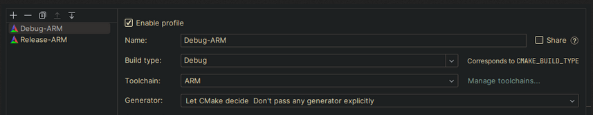
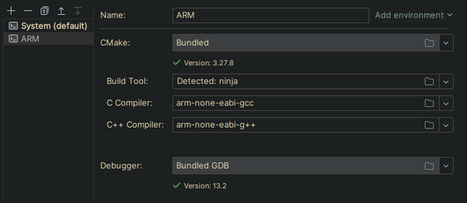
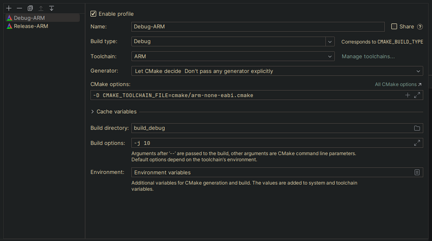

># STM32F412
>*HAL library and bootloader for STM32F412*
>## Setup
>1. open the project in clion
>2. Open the toolchain editor by pressing the 'Manage toolchains...' 
>3. configure the ARM toolchain 
>4. configure the run configuration 